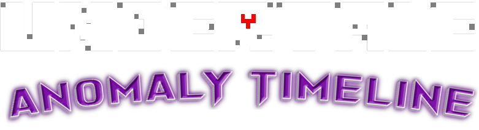

# Undertale: Anomaly Timeline

  

## 소개

**Undertale: Anomaly Timeline**은 오리지널 Undertale의 세계관을 확장한 팬 게임입니다. 이 게임은 몰살 루트를 진행하던 중 코어에서 예상치 못한 사건을 맞이하게 된 주인공의 여정을 그립니다. 잊혀진 과학자의 이야기와 시간, 공간, 그리고 공허(Void)의 비밀을 탐험하게 됩니다.

> *"오랫동안 잊혀졌던 것들이 다시 모습을 드러냅니다. 그들을 어떻게 대할지는 당신에게 달려있습니다."*

  
게임 스크린샷

  
  

## 주요 특징

✨ **새로운 모험**: 오리지널 Undertale에서는 볼 수 없었던 장소와 이야기  
🔀 **중요한 선택**: 당신의 결정에 따라 다양한 결말로 이어집니다  
🔍 **숨겨진 비밀**: 연구소 곳곳에 흩어진 단서를 모아 진실에 다가가세요  
👥 **새로운 캐릭터와의 만남**: 잊혀진 존재들과 교류하며 그들의 이야기를 발견하세요  

## 주요 캐릭터

<table>
  <tr>
    <td width="30%"><b>주인공</b></td>
    <td>
      • 몰살 루트 도중 예상치 못한 상황에 처한 인간 
      • 당신의 선택에 따라 운명이 바뀝니다
    </td>
  </tr>
  <tr>
    <td><b>샌즈</b></td>
    <td>
      • 미스터리한 골격 몬스터 
      • 코어에서 만난 후, 주인공에게 의미심장한 질문을 던집니다
    </td>
  </tr>
  <tr>
    <td><b>W.D. 가스터</b></td>
    <td>
      • 잊혀진 왕실 과학자 
      • 그의 존재와 실험의 비밀이 이야기의 중심이 됩니다
    </td>
  </tr>
  <tr>
    <td><b>플라위</b></td>
    <td>
      • 예상치 못한 곳에서 주인공을 만나 중요한 정보를 제공합니다 
      • 그의 진정한 의도는 무엇일까요?
    </td>
  </tr>
  <tr>
    <td><b>융합체들</b></td>
    <td>
      • 진실의 연구소에 존재하는 신비한 존재들 
      • 그들과의 상호작용은 게임의 중요한 분기점이 됩니다
    </td>
  </tr>
</table>

## 게임플레이

  <table>
    <tr>
      <td><b>🔎 탐험</b></td>
      <td>미스터리한 연구소와 숨겨진 장소들을 탐색하세요</td>
    </tr>
    <tr>
      <td><b>🔄 선택</b></td>
      <td>당신의 모든 행동과 결정이 스토리에 영향을 줍니다</td>
    </tr>
    <tr>
      <td><b>⚔️ 전투 또는 대화</b></td>
      <td>적대적인 존재들과 싸울지, 다른 방법을 찾을지는 당신의 선택입니다</td>
    </tr>
    <tr>
      <td><b>📝 비밀 발견</b></td>
      <td>흩어진 파일, 기록, 메모를 수집하여 퍼즐을 완성하세요</td>
    </tr>
  </table>

## 🎮 게임 조작
| 키 | 기능 |
|---|---|
| **방향키** | 이동/메뉴 선택 |
| **Z / 엔터 / 스페이스** | 확인/대화/공격 |
| **X** | 취소/메뉴 닫기 |
| **C** | 메뉴 열기 |
| **SHIFT** | 인트로/대사 스킵 |

## 테마

- **💫 선택과 결과**: 모든 행동에는 결과가 따릅니다
- **🧠 기억과 망각**: 잊혀진 것들이 모두 사라진 것은 아닙니다
- **🕰️ 시간과 공간**: 타임라인과 현실의 관계를 탐구합니다
- **💔 구원과 속죄**: 과거의 행동에서 벗어날 수 있을까요?

## 🛠️ 개발 정보
- **엔진**: Godot Engine 4.2
- **언어**: C++
- **해상도**: 640x480
- **플랫폼**: PC (Windows)
- **개발 상태**: 진행 중
- **예상 출시일**: 미정

## 📥 다운로드
> 🚧 아직 개발 중입니다.

---

  
<i>"때로는 과거의 그림자가 현재를 뒤덮기도 합니다..."</i>

  

<i>© 2025 Undertale: Anomaly Timeline - 팬 프로젝트</i> 
<small>이 게임은 Toby Fox의 Undertale에 영감을 받은 팬 작품으로, 원작과 직접적인 관련이 없습니다.</small>
